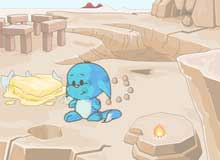

# Average Image CLI

This tool combines several images into a single "average image".


## Details

This tool can be used to remove foreground objects given enough images with similar backgrounds. Consider the following five photos:





These can be combined on a pixel-by-pixel basis, rejecting outliers based on [number of standard deviations away from the mean](https://en.wikipedia.org/wiki/68%E2%80%9395%E2%80%9399.7_rule).

The default uses $N=1.3\sigma$ to create the following image:

```sh
go run main.go \
  --path=Demo/Input/*.jpeg \
  --output=Demo/output_default.jpeg
```


Increasing the permissiveness of the filter to $N=2\sigma$ creates the following image:

```sh
go run main.go \
  --N=2 \
  --path=Demo/Input/*.jpeg \
  --output=Demo/output_2sigma.jpeg
```
